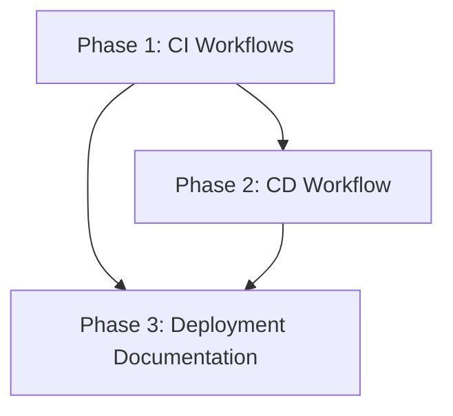

# Implementation Plan - Project Badeheyaat CI/CD

**Date:** 2026-02-21
**Phase:** 2 (Planning)

## 1. Plan Overview
- **Total Phases:** 3
- **Agents:** DevOps Engineer, Technical Writer
- **Estimated Effort:** ~2 Days

## 2. Dependency Graph

## 3. Execution Strategy

| Phase | Agent | Mode | Dependencies |
|-------|-------|------|--------------|
| 1. CI Workflows | devops-engineer | Sequential | None |
| 2. CD Workflow | devops-engineer | Sequential | P1 |
| 3. Deployment Documentation | technical-writer | Sequential | P1, P2 |

## 4. Phase Details

### Phase 1: CI Workflows
**Objective:** Setup path-filtered CI checks for frontend, backend, and microservice.
**Agent:** `devops-engineer`
**Files to Create:**
- `.github/workflows/ci-backend.yml`: Strapi lint & build checks.
- `.github/workflows/ci-frontend.yml`: Next.js lint & build checks.
- `.github/workflows/ci-microservice.yml`: Microservice lint & build checks.
**Implementation Details:**
- Use `on.push.paths` and `on.pull_request.paths`.
- Steps: Checkout, Node setup, Cache, Install, Lint, Build.
**Validation:**
- Workflow YAML validation.
- Mock path trigger test (manual verification of YAML logic).

### Phase 2: CD Workflow
**Objective:** Setup automated deployment to VPS via SSH.
**Agent:** `devops-engineer`
**Files to Create:**
- `.github/workflows/deploy.yml`: Main deployment pipeline.
**Implementation Details:**
- Use `appleboy/ssh-action`.
- Secret Injection: Write `ENV_FILE_CONTENT` to `.env` on VPS.
- Commands: `git pull`, `docker compose up -d --build`.
**Validation:**
- Workflow YAML validation.

### Phase 3: Deployment Documentation
**Objective:** Provide guide for VPS setup and GitHub Secrets.
**Agent:** `technical-writer`
**Files to Create/Modify:**
- `docs/DEPLOYMENT_GUIDE.md`: Comprehensive guide for project owner.
- `README.md`: Add CI/CD status badges and deployment section.
**Validation:**
- Documentation accuracy and link checks.

## 5. File Inventory
| File | Phase | Purpose |
|------|-------|---------|
| `.github/workflows/ci-backend.yml` | 1 | CI for Strapi |
| `.github/workflows/ci-frontend.yml` | 1 | CI for Next.js |
| `.github/workflows/ci-microservice.yml` | 1 | CI for Microservice |
| `.github/workflows/deploy.yml` | 2 | CD for VPS |
| `docs/DEPLOYMENT_GUIDE.md` | 3 | Instructions |

## 6. Risk Assessment
- **Phase 2 (CD)**: MEDIUM. SSH key format and VPS connectivity can be problematic. *Mitigation*: Detailed troubleshooting in documentation.
- **Phase 1 (CI)**: LOW. Standard GitHub Actions patterns.

